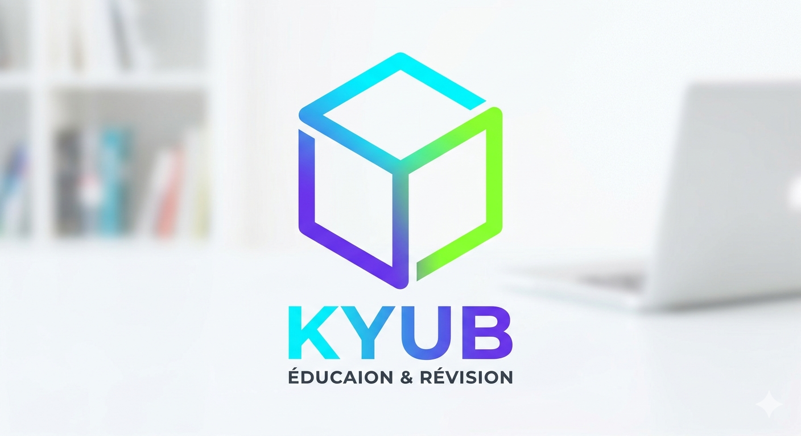

# KYUB — L'Éducation en 3D 🎲

[](https://web.dev/progressive-web-apps/)
[](#)
[](#)

**KYUB** est une application web progressive (PWA) révolutionnaire qui transforme la révision scolaire en une expérience immersive, sociale et hautement gamifiée. Conçue pour les collégiens et lycéens, KYUB utilise des mécanismes de mémorisation active et de répétition espacée à travers une interface 3D élégante.



## ✨ Fonctionnalités Clés

### 📱 Feed Académique Immersif
Un flux de contenus pédagogiques personnalisés selon ton niveau et tes matières. Découvre des "Stories" de révision et des posts interactifs pour apprendre sans t'en rendre compte.

### 🎲 Le "Kyub" (Révision 3D)
L'innovation centrale de l'application :
- **Interaction 3D** : Manipule un cube virtuel représentant tes chapitres.
- **Évaluation par Swipe** : Glisse à gauche si c'est facile, à droite si c'est difficile. L'algorithme adapte tes prochaines révisions.
- **Grand Kyub** : Valide tes connaissances sur les 6 faces du cube pour compléter ta collection.

### 🃏 Flash-Swipe
Un système de flashcards ultra-rapide inspiré des meilleures applications de dating. Maîtrise tes définitions et formules en un clin d'œil.

### 🏆 Gamification & Progression
- **XP & Niveaux** : Gagne de l'expérience à chaque interaction.
- **Streaks 🔥** : Maintiens ta série de révision pour débloquer des bonus.
- **Collection de Matériaux** : Selon tes scores, tes Kyubs changent d'apparence (Graphite, Acier, Titane, Or, et le légendaire Plasma 🌌).

### 🧪 Assistant Labo AI
Un compagnon d'étude intelligent disponible 24/7. Pose tes questions les plus complexes, il t'explique les concepts comme sur TikTok.

## 🛠️ Architecture Technique

KYUB est bâti sur une architecture légère et performante :

- **Frontend Core** : Vanilla HTML5 / CSS3 (Variables, Grid, Flexbox) / JavaScript moderne.
- **Moteur 3D** : CSS 3D Transforms pour une fluidité maximale sans dépendance lourde.
- **Persistence** : Stockage local des préférences et de la progression.
- **Offline First** : Service Worker optimisé pour une utilisation dans les transports ou au lycée sans connexion.

## 🚀 Installation

### En tant qu'App (PWA)
1. Ouvre l'URL dans ton navigateur mobile (Safari sur iOS, Chrome sur Android).
2. Clique sur la bannière d'installation ou sur "Sur l'écran d'accueil" dans le menu de partage.
3. Lance **KYUB** directement depuis ton écran d'accueil comme une app native.

### Pour le Développement
1. Clone le dépôt.
2. Utilise un serveur local (ex: `npx serve .`).
3. Accède à `http://localhost:3000`.

## 📁 Structure du Projet

```text
├── assets/             # Ressources graphiques et logos
├── css/                # Design System (variables.css, components.css)
├── js/                 # Logique applicative
│   ├── app.js          # Contrôleur principal et routage
│   ├── mockData.js     # Données de test et configuration
│   └── *_database.js   # Bases de données pédagogiques (QCM, Flashcards)
├── pages/              # Vues spécifiques (optionnel)
├── index.html          # Point d'entrée (Single Page App)
├── manifest.json       # Configuration PWA
└── sw.js               # Service Worker (Cache & Offline)
```

---

*Développé avec ❤️ pour la réussite scolaire.*
